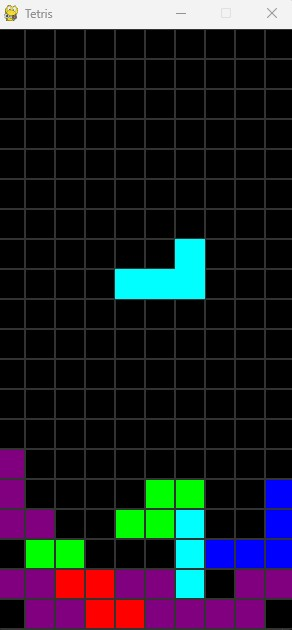

# 🧱 Tetris in Pygame

A classic **Tetris game clone** built with Python and Pygame. This version features colored tetrominoes, grid-based collision detection, rotation, line clearing, and a clean visual design — all in under 300 lines of code.

 <!-- Add a screenshot if you have one -->

---

## 🎮 Features

- ✅ Randomly generated tetromino shapes (I, O, T, S, Z, L, J)  
- ✅ Smooth piece movement and rotation  
- ✅ Line clearing with automatic shifting  
- ✅ Collision detection and piece locking  
- ✅ Game over condition  
- ✅ Fully rendered colored grid with cell outlines  

---

## 🚀 Getting Started

### Requirements
- Python 3.7+
- [Pygame](https://www.pygame.org/) (`pip install pygame`)

### Run the Game

```bash
git clone https://github.com/yourusername/tetris-pygame.git
cd tetris-pygame
python main.py
